# Nibble Kitchen

Nibble Kitchen is an e-commerce site offering various confections.

The site is fully responsive and was built using the Django framework in Python.

The live site has been deployed [here](https://nibble-kitchen.herokuapp.com/).

The payment system used for the site is called Stripe. The system is set up in a 'dummy' mode and will not accept real card details.

To test this functionality, please use the card details that can be [found here](https://stripe.com/docs/payments/accept-card-payments?platform=web&ui=elements#web-test-integration).

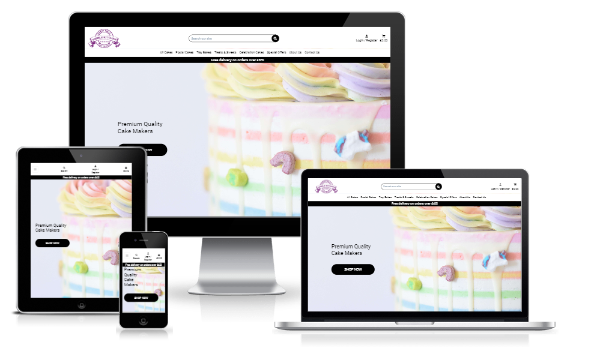

## Contents

- [User Experience (UX)](#user-experience-ux)

  - [User Stories](#user-stories)

    - [Navigation](#navigation)
    - [Accounts](#accounts)
    - [Admin](#admin)
    - [Purchasing](#purchasing)
    - [Interaction](#interaction)

  - [Design](#design)

    - [Colours](#colour)
    - [Fonts](#fonts)
    - [Images](#images)
    - [Wireframes](#wireframes)
    - [Database Schema](#database-schema)

- [Features](#features)

  - [Nav Bar](#nav-bar)
  - [Home page](#home-page)
  - [Accounts](#accounts)
  - [Profile](#profile)
  - [All Products](#all-products)
  - [Product Details](#product-details)
  - [Product Management](#product-management)
  - [Cart](#cart)
  - [Checkout](#checkout)
  - [Celebration Cakes](#celebration-cakes)
  - [About Us](#about-us)
  - [Contact](#contact-us)
  - [Toasts and Pop-ups](#toasts-and-pop-ups)
  - [Footer](#footer)
  - [Other](#other)

- [Testing](#testing)
- [Deployment](#deployment)

  - [Github](#github)
  - [Django](#django)
  - [Heroku](#heroku)
  - [AWS](#clone)
  - [Stripe](#Stripe)

- [Credits](#credits)

  - [Media](#media)
  - [Languages](#languages)
  - [Libraries, Frameworks & Tools](#libraries-frameworks-and-tools)

## User Experience (UX)

### User Stories

- #### Navigation

  - As a user, I want to navigate round the site easily to locate the products I want.
  - As a user, I want to view a list of all available products.
  - As a user, I want to be able to view more details on a product, such as price, ingredients and reviews.
  - As a user, I want to be able to refine my search with categories.
  - As a user, I want to be able to sort products by price, review or name.
  - As a user, I want to be able to easily contact the site owner if needed.
  - As a user, I want to be able to see all ingredients contained within the product, including any allergens.

- #### Accounts

  - As a user, I want the option to register for an account, allowing me to save my details and see previous orders.
  - As a user, I want to receive confirmation emails to confirm my registration.
  - As a user, I want the ability to be able to log in and out, and be able to easily work out my current login status.
  - As a user, I want to be able to recover my account information in the event that I forget it.

- #### Admin

  - As an admin, I want to be able to add products easily in a format consistent with the rest of the site.
  - As an admin, I want to be able to edit products easily to ensure the customer is being shown the most up to date information
  - As an admin, I want to be able to delete discontinued products, or mark seasonal products out of stock when not available.
  - As an admin, I want to be able to easily manage the images in the gallery, and update the site policies.
  - As an admin, I want to be able to add and update the ingredients for products, and mark any allergens appropriately.

- #### Purchasing

  - As a user, I want to be able to add items to my cart, allowing me to store things until I'm ready to complete my purchase.
  - As a user, I want to be able to view my cart so I can see the current running total of my potential purchases.
  - As a user, I want the ability to update the quantity of the items in my cart easily.
  - As a user, I want an easily viewable total to allow me to monitor my overall spend.
  - As a user, I want to be able to complete the purchasing journey, without the need to register if I do not wish to.
  - As a user, I want to receive confirmation of my order so I know my order was placed successfully.
  - As a user, I want to be able to view my order history so I can review past purchases.

- #### Interaction

  - As a user, I want to be able to leave a review of products to share my experience with other customers
  - As a user, I want to be able to easily connect to the business' social media pages to keep up to date.
  - As a user, I want to be able to easily contact the site owner if needed.

#

[Back to top ⇧](#nibble-kitchen)

#

## Design

- ### Colours

  The decision was made to keep the colours as simple as possible for the website, with the main content being either black text on a white background, or vice versa.

  This is due to cakes and confectionary being inherently colourful. By reducing the colour palette to the most basic possible helps draw attention to the products displayed, and the colours within.

  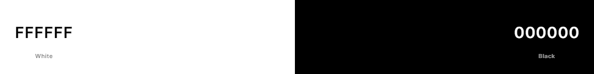

- ### Fonts

  The [Roboto](https://fonts.google.com/specimen/Roboto) font from Google Fonts is used throughout the site on all content.

  This font was chosen due to it's readability, popularity and familiarity, with it being the chosen font for a number of products produced by Google.

- ### Images

  All product images have been taken from the current website for [Nibble Kitchen](https://nibblekitchen.co.uk/), with permission from the owner.

  Other images used throughout the site were chosen from the website [Unsplash](https://unsplash.com/) and were chosen to fit the overall theme of the website.

  Image credits can be found in the [Media](#media) section of this Readme.

- ### Wireframes

- ### Database Schema

  The database schema for the project was:

  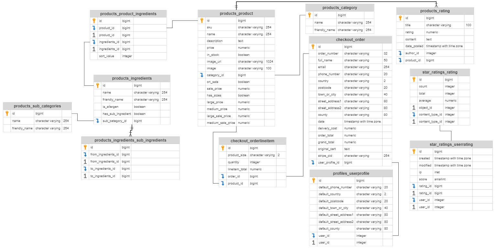

  The full image can be viewed [here](readme_content/schema.png)

#

[Back to top ⇧](#nibble-kitchen)

#

## Features

- ### Nav Bar

  - Links
    

    - To allow easy navigation around the site, the navbar is fixed to the top of each page and contains links to all areas of the website, with the exception of the information in the [footer](#footer).
    - The navbar collapses to a hamburger menu once the window width drops below 992px to ensure all information is displayed comfortably to the user.
    - All links, with the exception of About Us and Contact Us, make use of Bootstrap's dropdown plugin. Upon a link being clicked, more options are shown to the user.-

  - Search Bar

    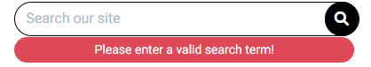

    - The search bar is located in the middle of the navbar, above the links and can be used to search the site for products.
    - The search term entered will be used to search the database for any products with matching information in either the product title, product description or product ingredients.
    - On screens with a width below 992px, the search bar is hidden and can be displayed by clicking on the 'Search' button that is present in the navbar.
    - JQuery is used to check the content of the search bar. If no search term has been entered, a warning is shown to the user for 5 seconds.

  - Account

    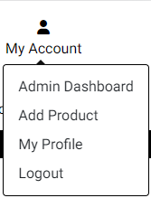

    - A user icon is located in the top right of the page, allowing the user access to manage their account and personal information.
    - Clicking on the icon displays a dropdown menu using Bootstrap's dropdown plugin with a number of options
      - Login & Register are displayed if the user is not logged in.
      - My Profile & Logout are displayed if the user is logged in.
      - Admin Dashboard & Add Product are displayed if the user is a superuser.

  - Cart

    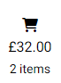

    - A cart icon is also located in the top right corner of the page displaying the value of the current contents of the cart, and the number of items that are present in the cart.
    - Clicking the cart icon will take the user to the [cart](#cart) page where they can complete their shopping journey.

  - Banner

    

    - A banner is displayed below the navbar advising the user on the current offer for free delivery.
    - If the user does not have any products in their cart, a message is shown stating 'Free delivery on orders over £65'
    - If the user does have items in their cart, the message is updated to notify the customer how much more they need to speed to ready the £65 free delivery limit.

#

[Back to top ⇧](#nibble-kitchen)

#

- ### Home Page

  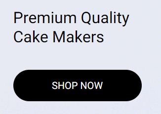

  - The home page has been designed with a minimalist appearance, containing only a hero image, a message, and a button directing the customer to view products on the site.
  - The hero image can be seen in the [Media](#media) section of this readme.
  - The message informs the user of the purpose of the site in a succinct manner, with the action of the button being made obvious by the label contained within.

- ### Accounts

  - Registration Page
    - The registration page is used by users to create a new account for the site.
    - Form validation is used to ensure all fields on the form are completed. If this validation fails, a message is shown to the user and the form is not submitted.
    - Once form validation has passed, the form will be submitted and the user will receive a confirmation email to verify their account.
    #
    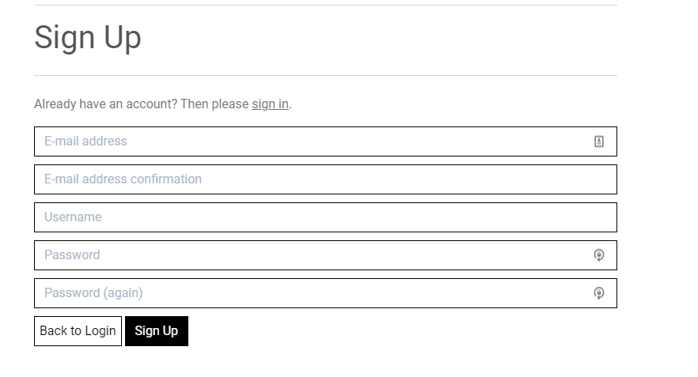
    #
  - Login Page
    - The login page is used for users with an existing account to log in to the site.
    - If the user has not verified their account by clicking on the link in the email they are sent, they will be unable to log in.
    - A 'Forgot Password' link is present for users to recover their account in the event that they cannot remember the required information to log in.
    #
    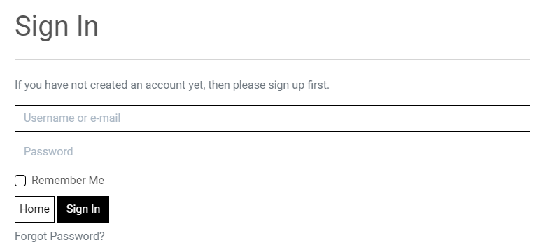
    #
  - Logout page
    - The logout page is used by users to log out if they are signed in, removing their session information.
    - The user will be taken to a confirmation page upon clicking the 'Logout' link, to ensure this is the action they wish to take.
    #
    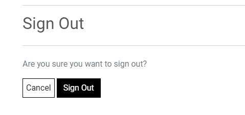
    #

#

[Back to top ⇧](#nibble-kitchen)

#

- ### Profile

  - Heading

    - The heading of the profile page will display the user's username. In the event that this information cannot be obtained, 'My Profile' will be displayed instead.
      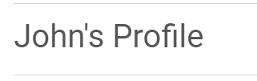

  - Delivery Information
  - The delivery information section shows any stored address information for the user.
  - The information can be updated on this page, and these change will be used to autocomplete the delivery address when placing an order.
  - The information displayed in this section can also be updated when the user completes the shop journey if they check the 'Save this delivery information to my profile' box.
    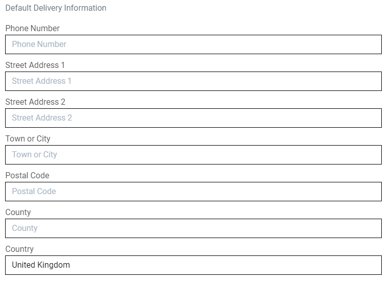

  - Order History
    - The order history section displays all previous orders placed by the logged-in user.
    - This section will display the order number, date of order, items ordered, quanitity ordered and the overall total.
    - Clicking on the hyperlink tag surrounding each order number will direct the user to a more detailed summary of the order.
      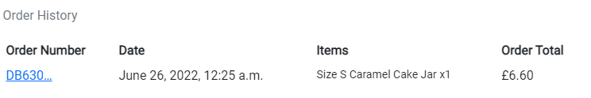

#

[Back to top ⇧](#nibble-kitchen)

#

- ### All Products

  - Products Page

    - The products page displays a list of available products in a selected category, search term or, if the correct option is selected, all products are shown.
    - Each product card show an image of the product, the price (or price range), the category in which the product resides and the rating. If no ratings are available 'No Rating' is shown in its place.
    - If a product is on sale, the original price will be shown with strikeout styling applied, the sale price will be shown and a small badge will be placed next to the prices to show the percentage of discount being given.
      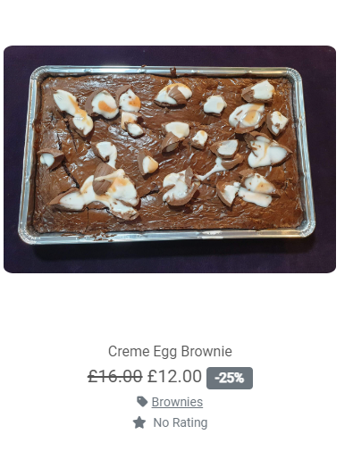

  - Sorting

    - The sort-by box is located in the top right of the products section on screen sizes above 768px width, and in the centre below 768px width.
    - Clicking on the box displays the sorting options available to the user.
      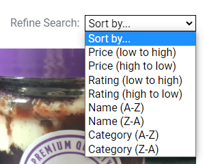

#

[Back to top ⇧](#nibble-kitchen)

#

- ### Product Details

  - Product Info
    - The product info section of the product details page shows all the important information related to each product.
    - The name of the product is displayed at the top of this section and is also added to the

- ### Product Management

- ### Cart

- ### Checkout

- ### About Us

- ### Contact Us

- ### Toasts and Pop-ups

- ### Footer

- ### Other

#

[Back to top ⇧](#nibble-kitchen)

#

## Testing

## Deployment

- ### Github

- ### Django

- ### Heroku

- ### AWS

- ### Stripe

## Credits

- [Delboy](https://github.com/Delboy) for the "Back to Top" idea in the readme.

- ### Media

  - All product images have been taken from the current website for [Nibble Kitchen](https://nibblekitchen.co.uk/), with permission from the owner.

  - The [main background image used on the 'Home' page](https://unsplash.com/photos/YpIKbBZtSWY) was made available via [Unsplash](https://unsplash.com/) by the user [American Heritage Chocolate](https://unsplash.com/@americanheritagechocolate) and is used under the Unsplash License.

  - The [image used on the 'About Us' page](https://unsplash.com/photos/5K5Nc3AGF1w) was made available via [Unsplash](https://unsplash.com/) by the user [Deva Williamson](https://unsplash.com/@biglaughkitchen) and is used under the Unsplash License.

- ### Languages

  - [Bootstrap](https://getbootstrap.com/)
  - [CSS](https://en.wikipedia.org/wiki/CSS)
  - [Django](https://www.djangoproject.com/)
  - [HTML5](https://en.wikipedia.org/wiki/HTML5)
  - [Javascript](https://en.wikipedia.org/wiki/JavaScript)
  - [JQuery](https://en.wikipedia.org/wiki/JQuery)
  - [Python](<https://en.wikipedia.org/wiki/Python_(programming_language)>)

- ### Libraries, Frameworks and Tools

  - [AllAuth](https://www.intenct.nl/projects/django-allauth/) - Django app used for local authentication.
  - [Am I Responsive](http://ami.responsivedesign.is/) - Used to verify responsiveness of website on different devices.
  - [Balsamiq](https://balsamiq.com/) - Used to generate Wireframe images.
  - [Browser Stack](https://www.browserstack.com/) - Used for Cross Site Browser Testing.
  - [Chrome Dev Tools](https://developer.chrome.com/docs/devtools/) - Used for overall development and tweaking, including testing responsiveness and performance.
  - [Django Crispy Forms](https://django-crispy-forms.readthedocs.io/en/latest/) - Django app to allow control over rendering behaviour of django forms.
  - [Django Quill Editor](https://github.com/LeeHanYeong/django-quill-editor) - WYSIWYG editor added for easy updating of text only content on the site.
  - [Favicon.io](https://favicon.io) - Used to generate Favicon image.
  - [Font Awesome](https://fontawesome.com/) - Used for icons on multiple pages.
  - [GitHub](https://github.com/) - Used for version control.
  - [Gunicorn](https://gunicorn.org/) - Python WSGI HTTP Server
  - [Heroku](https://heroku.com) - Used for deployment and hosting of the project.
  - [JQuery](https://en.wikipedia.org/wiki/JQuery) - Used to simplify definition of DOM elements, but used minimally with a preference for vanilla Javascript.
  - [JSHint](https://jshint.com/about/) - Linter used to flag errors, bugs and warnings.
  - [Pillow](https://pypi.org/project/Pillow/) - Python Imaging Library to add image processing capabilities to the project.
  - [Prettier](https://marketplace.visualstudio.com/items?itemName=esbenp.prettier-vscode) - Used for consistent code formatting.
  - [Slack](https://slack.com/) - Used for support and advice from the Code Insitute Community.
  - [Sorted M2M Filter Horizontal Widget](https://pypi.org/project/django-sortedm2m-filter-horizontal-widget/) - Django admin widget to allow horizontal sorting of products and ingredients.
  - [Visual Studio Code](https://code.visualstudio.com/) - Application used for development of this site.
  - [W3C](https://www.w3.org/) - Used for HTML & CSS Validation.
  - [WAVE](https://wave.webaim.org/) - Used for Accessibility evaluation.
  - [Woosmap](https://www.woosmap.com/) - Provided address searching API for checkout app.
