# Nibble Kitchen

Nibble Kitchen is an e-commerce site offering various confections.

The site is fully responsive and was built using the Django framework in Python.

The live site has been deployed [here](https://nibble-kitchen.herokuapp.com/).

The payment system used for the site is called Stripe. The system is set up in a 'dummy' mode and will not accept real card details.

To test this functionality, please use the card details that can be [found here](https://stripe.com/docs/payments/accept-card-payments?platform=web&ui=elements#web-test-integration).

## Contents

- [User Experience (UX)](#user-experience-ux)

  - [User Stories](#user-stories)

    - [Navigation](#navigation)
    - [Accounts](#accounts)
    - [Admin](#admin)
    - [Purchasing](#purchasing)
    - [Interaction](#interaction)

  - [Design](#design)

    - [Colours](#colour)
    - [Fonts](#fonts)
    - [Images](#images)
    - [Wireframes](#wireframes)
    - [Database Schema](#database-schema)

- [Features](#features)

  - [Nav Bar](#nav-bar)
  - [Home page](#home-page)
  - [Accounts](#accounts)
  - [Profile](#profile)
  - [All Products](#all-products)
  - [Product Details](#product-details)
  - [Product Management](#product-management)
  - [Cart](#cart)
  - [Checkout](#checkout)
  - [Celebration Cakes](#celebration-cakes)
  - [About Us](#about-us)
  - [Contact](#contact-us)
  - [Toasts](#toasts)
  - [Footer](#footer)
  - [Other](#other)

- [Testing](#testing)
- [Deployment](#deployment)

  - [Github](#github)
  - [Django](#django)
  - [Heroku](#heroku)
  - [AWS](#clone)
  - [Stripe](#Stripe)

- [Credits](#credits)

  - [Media](#media)
  - [Languages](#languages)
  - [Libraries, Frameworks & Tools](#libraries-frameworks-and-tools)

## User Experience (UX)

### User Stories

- #### Navigation

  - As a user, I want to navigate round the site easily to locate the products I want.
  - As a user, I want to view a list of all available products.
  - As a user, I want to be able to view more details on a product, such as price, ingredients and reviews.
  - As a user, I want to be able to refine my search with categories.
  - As a user, I want to be able to sort products by price, review or name.
  - As a user, I want to be able to easily contact the site owner if needed.
  - As a user, I want to be able to see all ingredients contained within the product, including any allergens.

- #### Accounts

  - As a user, I want the option to register for an account, allowing me to save my details and see previous orders.
  - As a user, I want to receive confirmation emails to confirm my registration.
  - As a user, I want the ability to be able to log in and out, and be able to easily work out my current login status.
  - As a user, I want to be able to recover my account information in the event that I forget it.

- #### Admin

  - As an admin, I want to be able to add products easily in a format consistent with the rest of the site.
  - As an admin, I want to be able to edit products easily to ensure the customer is being shown the most up to date information
  - As an admin, I want to be able to delete discontinued products, or mark seasonal products out of stock when not available.
  - As an admin, I want to be able to easily manage the images in the gallery, and update the site policies.
  - As an admin, I want to be able to add and update the ingredients for products, and mark any allergens appropriately.

- #### Purchasing

  - As a user, I want to be able to add items to my cart, allowing me to store things until I'm ready to complete my purchase.
  - As a user, I want to be able to view my cart so I can see the current running total of my potential purchases.
  - As a user, I want the ability to update the quantity of the items in my cart easily.
  - As a user, I want an easily viewable total to allow me to monitor my overall spend.
  - As a user, I want to be able to complete the purchasing journey, without the need to register if I do not wish to.
  - As a user, I want to receive confirmation of my order so I know my order was placed successfully.
  - As a user, I want to be able to view my order history so I can review past purchases.

- #### Interaction

  - As a user, I want to be able to leave a review of products to share my experience with other customers
  - As a user, I want to be able to easily connect to the business' social media pages to keep up to date.
  - As a user, I want to be able to easily contact the site owner if needed.

#

[Back to top ⇧](#nibble-kitchen)

#

## Design

- ### Colours

  The decision was made to keep the colours as simple as possible for the website, with the main content being either black text on a white background, or vice versa.

  This is due to cakes and confectionary being inherently colourful. By reducing the colour palette to the most basic possible helps draw attention to the products displayed, and the colours within.

  

- ### Fonts

  The [Roboto](https://fonts.google.com/specimen/Roboto) font from Google Fonts is used throughout the site on all content.

  This font was chosen due to it's readability, popularity and familiarity, with it being the chosen font for a number of products produced by Google.

- ### Images

  All product images have been taken from the current website for [Nibble Kitchen](https://nibblekitchen.co.uk/), with permission from the owner.

  Other images used throughout the site were chosen from the website [Unsplash](https://unsplash.com/) and were chosen to fit the overall theme of the website.

  Image credits can be found in the [Media](#media) section of this Readme.

- ### Wireframes

- ### Database Schema

  The database schema for the project was:

  

  The full image can be viewed [here](readme_content/schema.png)

#

[Back to top ⇧](#nibble-kitchen)

#

## Features

- ### Nav Bar

  - Links
    

    - To allow easy navigation around the site, the navbar is fixed to the top of each page and contains links to all areas of the website, with the exception of the information in the [footer](#footer).
    - The navbar collapses to a hamburger menu once the window width drops below 992px to ensure all information is displayed comfortably to the user.
    - All links, with the exception of About Us and Contact Us, make use of Bootstrap's dropdown plugin. Upon a link being clicked, more options are shown to the user.-

  - Search Bar

    

    - The search bar is located in the middle of the navbar, above the links and can be used to search the site for products.
    - The search term entered will be used to search the database for any products with matching information in either the product title, product description or product ingredients.
    - On screens with a width below 992px, the search bar is hidden and can be displayed by clicking on the 'Search' button that is present in the navbar.
    - JQuery is used to check the content of the search bar. If no search term has been entered, a warning is shown to the user for 5 seconds.

  - Account

    

    - A user icon is located in the top right of the page, allowing the user access to manage their account and personal information.
    - Clicking on the icon displays a dropdown menu using Bootstrap's dropdown plugin with a number of options
      - Login & Register are displayed if the user is not logged in.
      - My Profile & Logout are displayed if the user is logged in.
      - Admin Dashboard & Add Product are displayed if the user is a superuser.

  - Cart

    

    - A cart icon is also located in the top right corner of the page displaying the value of the current contents of the cart, and the number of items that are present in the cart.
    - Clicking the cart icon will take the user to the [cart](#cart) page where they can complete their shopping journey.

  - Banner

    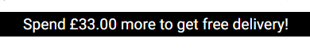

    - A banner is displayed below the navbar advising the user on the current offer for free delivery.
    - If the user does not have any products in their cart, a message is shown stating 'Free delivery on orders over £65'
    - If the user does have items in their cart, the message is updated to notify the customer how much more they need to speed to ready the £65 free delivery limit.

#

[Back to top ⇧](#nibble-kitchen)

#

- ### Home Page

  

  - The home page has been designed with a minimalist appearance, containing only a hero image, a message, and a button directing the customer to view products on the site.
  - The hero image can be seen in the [Media](#media) section of this readme.
  - The message informs the user of the purpose of the site in a succinct manner, with the action of the button being made obvious by the label contained within.

- ### Accounts

  - Registration Page
    - The registration page is used by users to create a new account for the site.
    - Form validation is used to ensure all fields on the form are completed. If this validation fails, a message is shown to the user and the form is not submitted.
    - Once form validation has passed, the form will be submitted and the user will receive a confirmation email to verify their account.
    #
    
    #
  - Login Page
    - The login page is used for users with an existing account to log in to the site.
    - If the user has not verified their account by clicking on the link in the email they are sent, they will be unable to log in.
    - A 'Forgot Password' link is present for users to recover their account in the event that they cannot remember the required information to log in.
    #
    
    #
  - Logout page
    - The logout page is used by users to log out if they are signed in, removing their session information.
    - The user will be taken to a confirmation page upon clicking the 'Logout' link, to ensure this is the action they wish to take.
    #
    
    #

#

[Back to top ⇧](#nibble-kitchen)

#

- ### Profile

  - Heading

    - The heading of the profile page will display the user's username. In the event that this information cannot be obtained, 'My Profile' will be displayed instead.

      

  - Delivery Information
  - The delivery information section shows any stored address information for the user.
  - The information can be updated on this page, and these change will be used to autocomplete the delivery address when placing an order.
  - The information displayed in this section can also be updated when the user completes the shop journey if they check the 'Save this delivery information to my profile' box.
    

  - Order History
    - The order history section displays all previous orders placed by the logged-in user.
    - This section will display the order number, date of order, items ordered, quanitity ordered and the overall total.
    - Clicking on the hyperlink tag surrounding each order number will direct the user to a more detailed summary of the order.
      

#

[Back to top ⇧](#nibble-kitchen)

#

- ### All Products

  - Products Page

    - The products page displays a list of available products in a selected category, search term or, if the correct option is selected, all products are shown.
    - Each product card show an image of the product, the price (or price range), the category in which the product resides and the rating. If no ratings are available 'No Rating' is shown in its place.
    - If a product is on sale, the original price will be shown with strikeout styling applied, the sale price will be shown and a small badge will be placed next to the prices to show the percentage of discount being given.
      

  - Sorting

    - The sort-by box is located in the top right of the products section on screen sizes above 768px width, and in the centre below 768px width.
    - Clicking on the box displays the sorting options available to the user.
      
    - Within `views.py`, an if statement is present to check if the sortkey contains `desc`. If `desc` is present, `nulls_last=True` is appended to the end of the search term to ensure products with ratings are shown before products with no ratings.

#

[Back to top ⇧](#nibble-kitchen)

#

- ### Product Details

  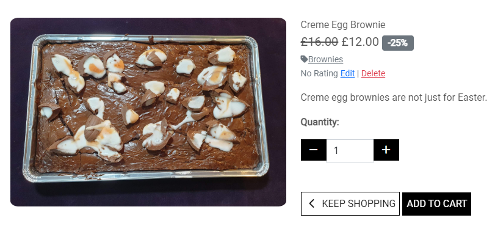

  - Product Info

    - The product info section of the product details page shows all the important information related to each product.
    - The left part of the product info section is taken up by an image of the product. The image can be enlarged upon clicking to enable a better view. This is done within the page using bootstrap, rather than opening a new tab.
    - The name of the product is displayed at the top of this section and is also added to the title of the page.
    - Below this, the price of the product is shown.
      - If the product is on sale, the original price will be shown with strikeout styling applied, the sale price will be shown and a small badge will be placed next to the prices to show the percentage of discount being given.
      - If the product has sizes, the prices are updated appropriately using JQuery. The values for these prices are obtained from a seperate file which, in turn, queries the database for the correct prices. This ensures the same code can be reused throughout the site.
    - The category for the current product is shown next, with an underline style applied to indicate a hyperlink. Clicking on this link will direct the user to the products page for that category.
    - The Rating for the product is shown next. The rating is calculated by dividing the sum of all reviews by the number of reviews. If there are no reviews for a product, 'No Rating' is shown instead.
    - `Edit` and `Delete` buttons are shown next to the rating if the current user has superuser privileges, allowing the requested action to take place.
    - If the product has different sizes available, the `Size` field will be shown allowing the user to pick between Small, Medium, or Large. This is mainly applicable for the cake jars.
    - The `Quantity` field is shown for all products and allows the user to increment or decrement the value either with the provided buttons, or by typing directly into the box. Javascript is used to check if the value is above 99, which will return the max value to 99 if true.
    - A pair of buttons with the text of `< Keep Shopping` and `Add to Cart` are displayed as the element of the product info section, respectively. The `< Keep Shopping` button will return the user to the main products page, with the `Add To Cart` button adding the item into the user's cart before returning them to the same page.

    #

    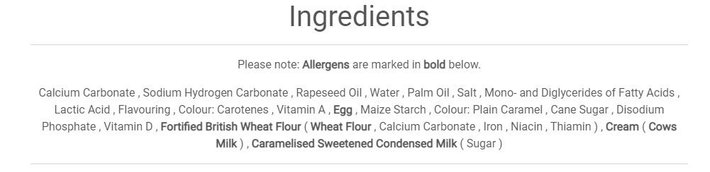

  - Ingredients

    - The Ingredients section is the first tab within the bottom section of the Product Details page. It begins with information advising that all allergens are marked in bold.
    - The ingredients are stored in the database for each product and are retrieved to be displayed on the page. This was done to ensure that any updates to allergens in the future take effect site wide and to ensure customers with allergens have the best information possible.
    - Below the ingredients section is a disclaimer, providing a list of allergens used and warning that items are baked in a single kitchen and that cross contamination between allergens is possible.

    #

    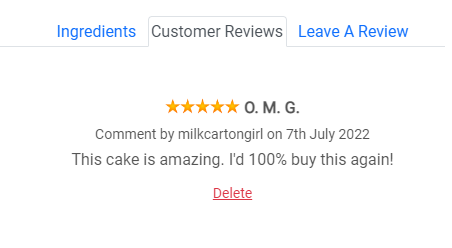

  - Customer Reviews

    - The Customer Reviews section displays any reviews that have been left by customers previously. If no reviews have been left, the user is instead shown a message stating: `There aren't any reviews for this product. Be the first to leave a review!`, with a link being provided to the `Leave A Review` tab.
    - If reviews are present in the database, the rating is obtained and the relevant rating image is displayed alongside the title of the review. Below this is the username and date on which the comment was made, followed by the comment itself.
    - Superusers and the original user who posted the comment have the ability to delete the comment if required. No user has the ability to edit user reviews to ensure the reviews section is perceived as trustworthy.

    #

    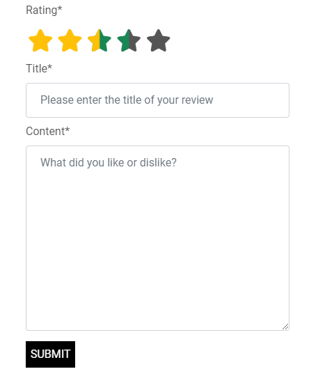

  - Leave A Review

    - The final section on the Product Details is for the user to leave a rating and review of the product.
    - The first part of the form allows the user to leave a rating between 0.5 and 5.0 stars. The rating already selected by the user is highlighted in `Yellow`, with a `Green` highlight being applied to any stars upto where the user is current highlighting with the mouse.
    - The `Title` and `Content` sections of the form allow the user to provided a title and the content of their review respectively.
    - Following the form being validated successfully, the form is submitted and the rating, title and content are submitted to the database. Along with this information, the product ID, date, time and user ID is also stored.
    - If a user has already left a review, they will instead be shown a message stating `You've already left a review for this product!`

- ### Product Management

  - Whether `Adding` or `Editing` a product the user is shown the same form, however the `Edit Product` page will already be populated with data.
  - Due to the similarities of the form, I will first discuss the form itself before going into the different between the two pages.
  - Both pages `REQUIRE` the following information:
    - Category
    - Name
    - Description
    - If the product `Has Sizes`
    - Price (This is used as the Small price for products with sizes, or standard price for other products)
    - Sale Price (This is used in the search function for the purpose of ensuring prices are sorted correctly)
    - Ingredients (The [Sorted M2M Filter Horizontal Widget](https://pypi.org/project/django-sortedm2m-filter-horizontal-widget/) was used to enable vertical sorting of products, replacing the standard `Hold Ctrl and Click` select menu.)
  - All other fields on the page are optional.
  - The only other difference between the pages, other than the ones already mentioned, is the additional modifying of the title when editing a product.

- ### Cart

  - The cart is split into two main elements
    - Products Section
    - Total Section

  #

  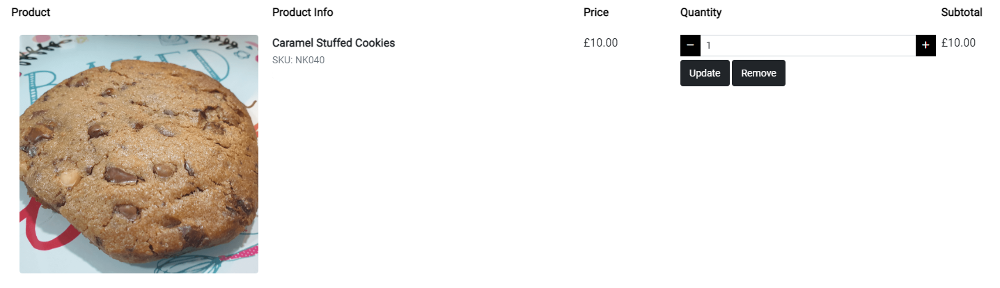

  - Products Section
    - The products section is also split down further into 5 sections:
      - The `Product` section displays an image for each of the products contained within the cart.
      - The `Product Info` section displays the name of the product chosen. If the product has a size value, if will be displayed on the following line, otherwise this value will not appear. Finally the SKU of the product will be displayed.
      - The `Price` section displays the unit price for the item, and size if applicable, chosen.
      - The `Quantity` section displays the current quantity of the product chosen, with controls provided to allow the user to update the quantity if they wish to.
      - The final section is the `Subtotal` section which multiplies the value from the `Price` field with the value of the `Quantity` field to calculate the total being paid for this item.

  #

  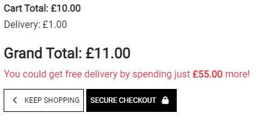

  - Total Section
    - The `Cart Total` field calculates the sum of all `Subtotal` values within the cart to determine the overall total value of products.
    - The `Delivery` field displays the value of the `Cart Total` field multiplied by the `STANDARD_DELIVERY_PERCENTAGE` value from `settings.py`. This is currently set to 10%.
    - The `Grand Total` field shows the sum of the `Cart Total` and `Delivery` fields.
    - Below the `Grand Total` field is a notice to the customer informing them of the required further spend for them to receive free delivery of their products. This value is calculated by subtracting the `Cart Total` value from the `FREE_DELIVERY_THRESHOLD` value set in `settings.py`. The delivery cost is not included in this calculation.
    - The final part of the `Total Section` are the `Keep Shopping` and `Secure Checkout` buttons. Like the `Product Detail` page, the `< Keep Shopping` button will return the user to the main products page, leaving the current products in the cart as they are. The `Secure Checkout` button will navigate the user to the `Checkout` page which is described in more detail in the next section.

- ### Checkout

  - The Checkout page is split into two main columns: Customer Details & Order Summary. The Checkout app also features a `Checkout Success` page once the order has been submitted, and a loading overlay whilst the order is being submitted.

    - Customer Details

      - The first section of this column asks for the customer to provide their name and email address. The name is required to ensure the correct delivery information is added to the package prior to it being dispatched, with the email address being used to send order confirmation to the customer. The customer is not required to sign in to complete their order, however if they are signed in, and have saved their delivery information, these fields will be populated.
        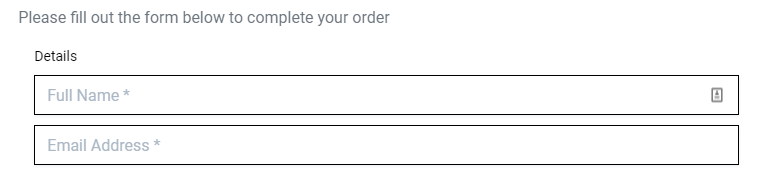
      - The box below this uses the Address Finder API provided by [Woosmap](https://www.woosmap.com/). This has been configured to only search for address within the UK as this is where the business is based. The user has the option of typing their address into this box and clicking the corresponding result, with the information then being used to fill the form below.
      - If the customer does not wish to use the Address Search feature, they can manually enter their details into the address details form, with the following details being required:
        - Phone Number
        - Street Address
        - Town or City
        - Post Code
      - If the user is already registered, and has delivery information stored, this information will be automatically populated.
      - The user also has the option to update or save their delivery information, which can be used to populate the form for future orders by ticking the checkbox below the form.
        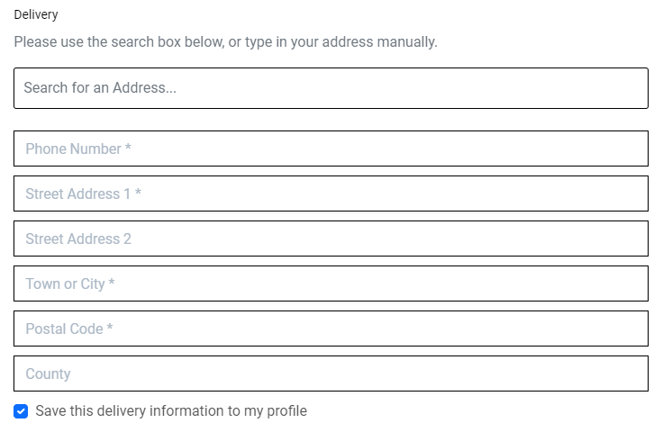
      - The payment element of the checkout app is provided by [Stripe](https://stripe.com/). Stripe is used as a secure payment method, and means that no card information is stored within the website database, with all information being provided back to the website via Webhooks.
        - If `payment_intent.succeeded` is returned via the webhook, the order will be submitted.
        - If `payment_intent.payment_failed` is returned via the webhook, the order is not submitted, with the user being returned to the checkout app, with a message provided stating the order has failed.
      - The following card details can be used to test the payment functionality of the Checkout App:

        | Scenario                           | Card Number         | Expiry Date | CVC | Postal Code |
        | ---------------------------------- | ------------------- | ----------- | --- | ----------- |
        | Payment Succeeds                   | 4242 4242 4242 4242 | Any         | Any | Any         |
        | Payment requires authentication    | 4000 0025 0000 3155 | Any         | Any | Any         |
        | Card declined - Insufficient Funds | 4000 0000 0000 9995 | Any         | Any | Any         |

      - The final elements of the `Customer Details` section are the `Adjust Cart` and `Complete Order` buttons. The `< Adjust Cart` button will return the user to the cart app, with any details entered into the form being lost, unless already saved to the users profile. The `Complete Order` button will first submit the payment information via the `Stripe` webhook.
      - Once `payment_intent.succeeded` is received the order will be submitted and the user will be navigated to the `Checkout Success` page.
        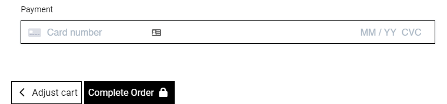

    - Order Summary

      - The order summary section shows a compacted version of the data displayed in the `Cart` app.
      - The title of the `Order Summary` section shows the number of products contained within the cart.
      - Each item within the cart is listed, including the size (if applicable) and quantity.
      - Unlike the `Cart` app, in the `Order Summary` view only the Subtotal for each product is shown.
      - As with the `Cart` app, the Order Total, Delivery charage and Grand Total values are shown to give the customer the opportunity to confirm everything looks correct before their order is submitted.
      - Using `Stripe` webhooks, the database is queried to confirm the order was created successfully. If the order cannot be found, the webhook handler will created the order in the database using the information sent with the original payment intent.
        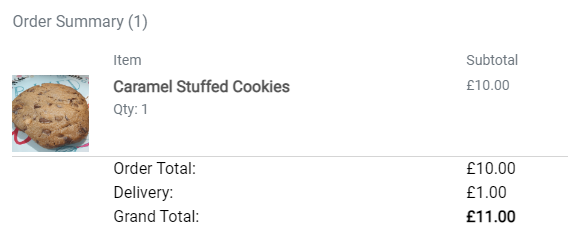

    - Loading Overlay

      - When the `Complete Order` button is clicked and the form validation on the checkout page is passed, a loading overlay is displayed preventing any other changes to the form, or any further form submissions.
      - The loading icon is provided by [Font Awesome](https://fontawesome.com/), using the `fa-cake-candles` class, and is animated with the `fa-beat` class.

        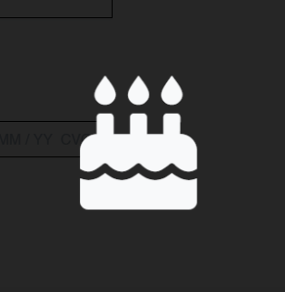

    - Checkout Success

      - Once all of the previous steps have been completed, the `payment_intent.succeeded` response has been received and confirmation that the order has been created in the database, the user is taken to the `Checkout Success` page.
      - Above the order summary itself, a message is shown advising the user that a confirmation email will be sent to them, confirming the details of their order.
      - The user is then provided with the `Order Number` and `Order Date`, which can be used in the event the customer needs to contact the business, speeding up the process of retrieving the relevant order.
      - The `Order Details` section provides further confirmation of the products that have been ordered, including quantity and individual unit price.
      - The `Delivering To` section displays the address information provided by the customer. This is important as it gives the customer a chance to check over the details and to confirm that they are correct.
      - The final section within the order summary box is the `Billing Info` section, providing a further recap of the Order Total, Deliverty charge and Grand Total of the order.
      - Below this is a message advising the customer to get in touch if they spot any errors on the form, ensuring that the corrections can be made as soon as possible.
      - Finally, a button containing the text `Take me back to the cakes!` is displayed and returns the user to the main `Products` page.
        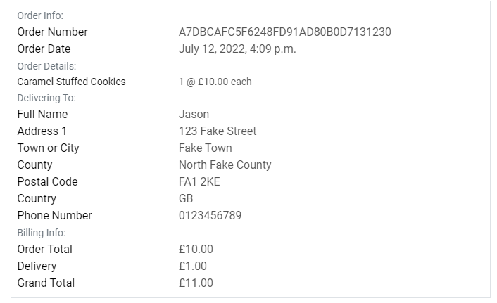

- ### About Us

  - The [image used on the 'About Us' page](https://unsplash.com/photos/5K5Nc3AGF1w) was made available via [Unsplash](https://unsplash.com/) by the user [American Heritage Chocolate](https://unsplash.com/@americanheritagechocolate) and is used under the Unsplash License.
  - The page gives a brief history of the business and the content is set using [Django Quill Editor](https://github.com/LeeHanYeong/django-quill-editor). This allows easier editing for the business owner without needing to have any knowledge of HTML or CSS.
  - The About Us page ends with a reminder to contact the business with any questions or queries, hopefully increasing engagement and leading to more business.

- ### Contact Us

  - The `Contact Us` page is linked to from various other places on the website and allows users to contact the business with any query they may have.
  - The form was purposefully left as basic as possible to give maximum flexibility to the user. The form consists of 3 text fields (Email, Subject and Message.)
  - Once all sections have been completed and the `Submit` button has been clicked, the information is stored in the database and the user is directed to the `Contact Success` page.
  - The `Contact Success` page contains a message stating `Thank for getting in touch with us. We've got your message, and we'll be in touch as soon as possible.`, with a button returning the user to the main products page.
  - The messages sent by users can be viewed from the admin panel, where the option is available to mark a message as actioned, allowing other people who may use the admin panel to see which messages have/have not been responded to.

    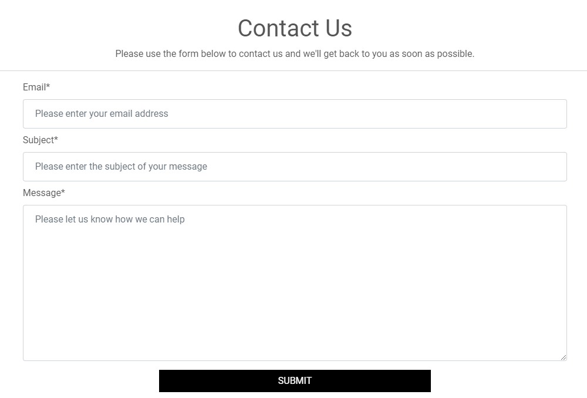

- ### Toasts

  - Toasts appear in the top-right corner on the screen when any information needs to be relayed to the user. The toasts appear using a CSS animation which alters the location of the toast.
  - The toasts display messages under the categories of `Success`, `Alert`, `Warning` and `Error`.
  - The toasts have slightly different designs depending on the type of toast used.

    - The `Alert`, `Warning` and `Error` toasts all share the same design of a dark header and dark body with only the colour of the icon on the alert change.
    - The `Success` toast instead has a dark header and light body. This is due to the amount of information displayed on the `Success` toast when items are added to the basic and aids readability for the user.

    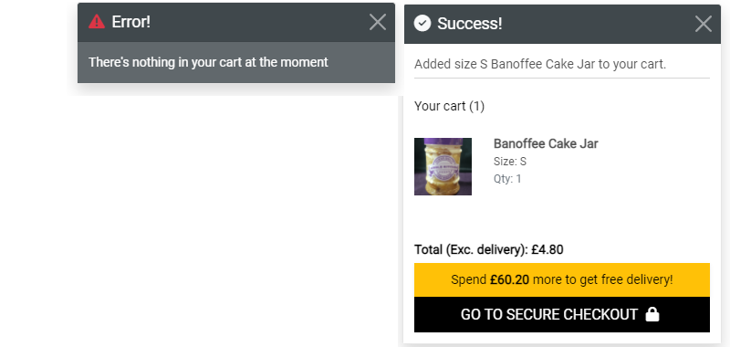

- ### Footer

  - The footer is displayed on all pages other than the main landing page of the website, and sits at the bottom of each page.
  - The top part of the footer is a full width div containing links to the Social Media pages for the business.
  - The lower section of the footer is split into three columns with the first having a short `About Us` synopsis. The title of the column also links to the `About Us` page, but is not underlined due to the link also being available in the navbar.
  - The middle column contains `Useful Links` which direct to individual pages for the Refunds & Returns Policy, Postage & Packaging Policy and Privacy Policy. Like the `About Us` page, all content on these pages is set using [Django Quill Editor](https://github.com/LeeHanYeong/django-quill-editor). This allows easier editing for the business owner without needing to have any knowledge of HTML or CSS.
  - The third and final column contains contact information for the business, with a `mailto:` link being used to highlight the email address.
  - Icons provided by [Font Awesome](https://fontawesome.com/) throughout the footer.

    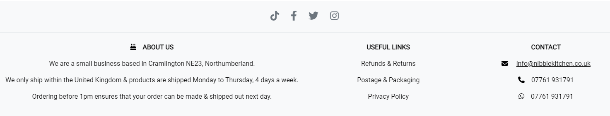

- ### Other

  - Error 404 Page

    If the user navigates to a page that does not exist, the 404.html page will render. This page has the same basic layout as the home page of the site, but displays different text content. The button, however, still returns the user to the main products page.

    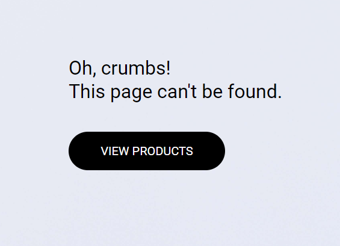

  - Error 500 Page

    If the user navigates to a page that causes a response the server does not know how to handle, the 500.html page will render. This page has the same basic layout as the home page of the site, but displays different text content. The button, however, still returns the user to the main products page.

    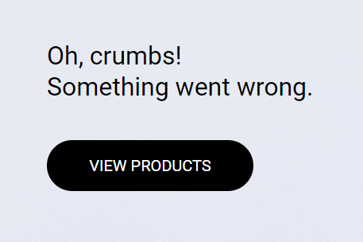

#

[Back to top ⇧](#nibble-kitchen)

#

## Testing

## Deployment

- ### Github

- ### Django

- ### Heroku

- ### AWS

- ### Stripe

## Credits

- [Delboy](https://github.com/Delboy) for the "Back to Top" idea in the readme.

- ### Media

  - All product images have been taken from the current website for [Nibble Kitchen](https://nibblekitchen.co.uk/), with permission from the owner.

  - The [main background image used on the 'Home' page](https://unsplash.com/photos/YpIKbBZtSWY) was made available via [Unsplash](https://unsplash.com/) by the user [Deva Williamson](https://unsplash.com/@biglaughkitchen) and is used under the Unsplash License.

  - The [image used on the 'About Us' page](https://unsplash.com/photos/5K5Nc3AGF1w) was made available via [Unsplash](https://unsplash.com/) by the user [American Heritage Chocolate](https://unsplash.com/@americanheritagechocolate) and is used under the Unsplash License.

- ### Languages

  - [Bootstrap](https://getbootstrap.com/)
  - [CSS](https://en.wikipedia.org/wiki/CSS)
  - [Django](https://www.djangoproject.com/)
  - [HTML5](https://en.wikipedia.org/wiki/HTML5)
  - [Javascript](https://en.wikipedia.org/wiki/JavaScript)
  - [JQuery](https://en.wikipedia.org/wiki/JQuery)
  - [Python](<https://en.wikipedia.org/wiki/Python_(programming_language)>)

- ### Libraries, Frameworks and Tools

  - [AllAuth](https://www.intenct.nl/projects/django-allauth/) - Django app used for local authentication.
  - [Am I Responsive](http://ami.responsivedesign.is/) - Used to verify responsiveness of website on different devices.
  - [Balsamiq](https://balsamiq.com/) - Used to generate Wireframe images.
  - [Browser Stack](https://www.browserstack.com/) - Used for Cross Site Browser Testing.
  - [Chrome Dev Tools](https://developer.chrome.com/docs/devtools/) - Used for overall development and tweaking, including testing responsiveness and performance.
  - [Django Crispy Forms](https://django-crispy-forms.readthedocs.io/en/latest/) - Django app to allow control over rendering behaviour of django forms.
  - [Django Quill Editor](https://github.com/LeeHanYeong/django-quill-editor) - WYSIWYG editor added for easy updating of text only content on the site.
  - [Favicon.io](https://favicon.io) - Used to generate Favicon image.
  - [Font Awesome](https://fontawesome.com/) - Used for icons on multiple pages.
  - [GitHub](https://github.com/) - Used for version control.
  - [Gunicorn](https://gunicorn.org/) - Python WSGI HTTP Server
  - [Heroku](https://heroku.com) - Used for deployment and hosting of the project.
  - [JQuery](https://en.wikipedia.org/wiki/JQuery) - Used to simplify definition of DOM elements, but used minimally with a preference for vanilla Javascript.
  - [JSHint](https://jshint.com/about/) - Linter used to flag errors, bugs and warnings.
  - [Pillow](https://pypi.org/project/Pillow/) - Python Imaging Library to add image processing capabilities to the project.
  - [Prettier](https://marketplace.visualstudio.com/items?itemName=esbenp.prettier-vscode) - Used for consistent code formatting.
  - [Slack](https://slack.com/) - Used for support and advice from the Code Insitute Community.
  - [Sorted M2M Filter Horizontal Widget](https://pypi.org/project/django-sortedm2m-filter-horizontal-widget/) - Django admin widget to allow horizontal sorting of products and ingredients.
  - [Stripe](https://stripe.com/) - Payment Processing Platform used to handle card details in the checkout app.
  - [Visual Studio Code](https://code.visualstudio.com/) - Application used for development of this site.
  - [W3C](https://www.w3.org/) - Used for HTML & CSS Validation.
  - [WAVE](https://wave.webaim.org/) - Used for Accessibility evaluation.
  - [Woosmap](https://www.woosmap.com/) - Provided address searching API for checkout app.
