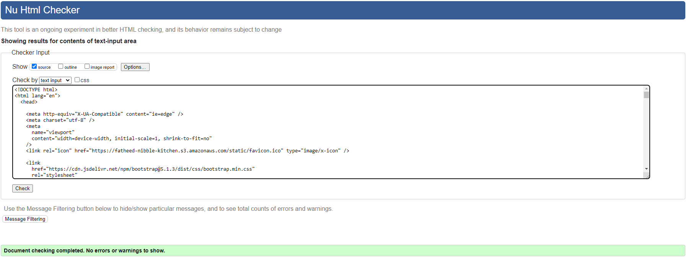

# Nibble Kitchen - Testing

## Contents

- [Validators](#validators)
  - [HTML](#html)
  - [CSS](#css)
  - [JSHint](#jshint)
  - [PEP8](#pep8)
  - [Lighthouse](#lighthouse)
  - [WAVE Testing](#wave-testing)

## Validators

### HTML

- HTML validation was carried out using the [Nu HTML Checker tool](https://validator.w3.org/) by W3C.
- Links are provided where the page could be tested using the URL.

#

- #### Home Page Validation

  - [Link](https://validator.w3.org/nu/?doc=https%3A%2F%2Fnibble-kitchen.herokuapp.com%2F)

  

- #### Products Page Validation

  - [Link](https://validator.w3.org/nu/?doc=https%3A%2F%2Fnibble-kitchen.herokuapp.com%2Fproducts%2F)

  

- #### Product Details Page Validation

  - [Link](https://validator.w3.org/nu/?doc=https%3A%2F%2Fnibble-kitchen.herokuapp.com%2Fproducts%2F1%2F)

  

- #### Celebration Cakes Page Validation

  - [Link](https://validator.w3.org/nu/?doc=https%3A%2F%2Fnibble-kitchen.herokuapp.com%2Fcakes%2F)

  

- #### About Us Page Validation

  - [Link](https://validator.w3.org/nu/?doc=https%3A%2F%2Fnibble-kitchen.herokuapp.com%2Fabout%2F)

  

- #### Contact Us Page Validation

  - [Link](https://validator.w3.org/nu/?doc=https%3A%2F%2Fnibble-kitchen.herokuapp.com%2Fcontact%2F)

  

- #### Profile Page Validation

  

- #### Cart Page Validation

  - [Link](https://validator.w3.org/nu/?doc=https%3A%2F%2Fnibble-kitchen.herokuapp.com%2Fcart%2F)

  

- #### Checkout Page Validation

  

- #### Checkout Success Page Validation

  

- #### Add / Edit Product Page Validation

  - Both errors displayed are part of the image upload widget and therefore cannot be changed without affecting the functionality of the page.

  

- #### Refunds & Returns Page Validation

  - [Link](https://validator.w3.org/nu/?doc=https%3A%2F%2Fnibble-kitchen.herokuapp.com%2Freturns%2F)

  

- #### Postage and Packaging Page Validation

  - [Link](https://validator.w3.org/nu/?doc=https%3A%2F%2Fnibble-kitchen.herokuapp.com%2Fpostage%2F)

  

- #### Privacy Policy Page Validation

  - [Link](https://validator.w3.org/nu/?doc=https%3A%2F%2Fnibble-kitchen.herokuapp.com%2Fprivacy%2F)

  

[Back to top ⇧](#nibble-kitchen---testing)

### CSS

- All CSS was checked with the official [Jigsaw validator](https://jigsaw.w3.org/css-validator/).

- Base.css
  

- Checkout.css
  

- Contact.css
  

- Products.css
  

- Rating.css
  

- Styles.css
  

[Back to top ⇧](#nibble-kitchen---testing)

### JSHint

- All Javascript was passed through Jshint.

- About Us Javascript
  

- Cart Javascript
  

- Product Javascript
  

- Product Detail Javascript
  

- Quantity Update Javascript
  

- Size Update Javascript
  

[Back to top ⇧](#nibble-kitchen---testing)

### PEP8

- PEP8 compliance was checked using the [Flake8](https://github.com/pycqa/flake8) and [Flake8 HTML](https://pypi.org/project/flake8-html/) tools.
- A report was generated by the [Flake8 HTML](https://pypi.org/project/flake8-html/) and can be found [here](https://htmlpreview.github.io/?https://github.com/Fatheed7/nibble-kitchen/blob/main/flake-report/index.html).

  

[Back to top ⇧](#nibble-kitchen---testing)

### Lighthouse

- Lighthouse, using Chrome Dev Tools, was used to ensure best practices were followed on the site.

- The test results can be found in full [here](readme_content/tests/lighthouse.pdf)

  

### Wave Testing

All pages on the site were tested using the [WAVE Web Accessibility Evaluation Tool](https://wave.webaim.org/). All pages returned **0 errors** and **0 contrast errors**.

Due to the number of pages contained on the site, I have not linked the images within this repository, but the site can be explored on the WAVE tool by clicking [this link](https://wave.webaim.org/report#/https://nibble-kitchen.herokuapp.com/).

